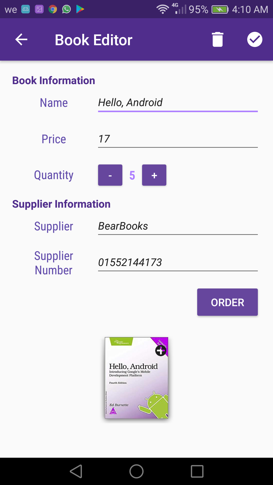
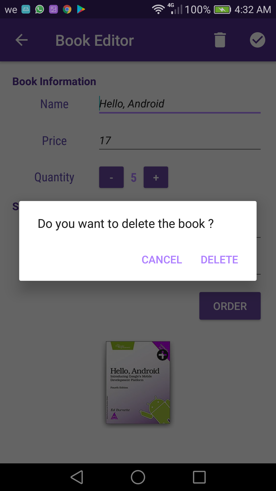

# BookStore Android APP
Multifunction Android APP which simulate Book Stores and The process of buying  
The main focus on this APP is showing my apility to work with databases

APP Work Flow
---------------
* Book Store owner add all avalible books in the store into the app 
* While adding the books information it's passing throw a lot of validations
* The Store Book Showing into the main app UI
* The store owner can edit any book information later by simply clicking on it
* The Customer Enter the app & watch all the products avalible in the store

Concepts Used
---------------
* Database Operations (Create, Insert, Delete, Update, Select).
* Database Content Providers.
* Database Contracts.
* Database OpenHelpers.
* Uris, UriMatchers
* Input Validations.
* Runtime Errors.
* Multi Threading , Loaders.
* Android APPs LifeCycle.
* Menues, Menus LifeCycle.
* ListView, CursorAdaptor, EmptyViews.
* Dialogs, ImagePickers, TouchListeners.
* Up/Back Navigation, Floating Btns.
* Implicit and Explicit Intents.
* APP UI Design & XML.
* Layout Best Practices (Text sizes are defined in sp, Lengths are defined in dp)
* External Libraries (ButterKnife, CardView)
* Naming Conventions (All variables, methods, and resource IDs are descriptively named)
* Fully Customized Styles & Layouts

Pre-requisites
--------------

- Android SDK 27
- Android Build Tools v27.1.1
- Android Support Repository

Screenshots
-------------

       

Getting Started
---------------

This app uses the Gradle build system. To build this project, use the
"gradlew build" command or use "Import Project" in Android Studio.

Contacts
-------

- Linkedin: https://www.linkedin.com/in/engmohamedosama/
- FaceBook: https://www.facebook.com/EngineerMohamedOsama
- Email: EngMohamedOsama@yandex.com

If you've found an error in this sample, please file an issue to email.

License
-------

Copyrights 2018 All Right Reserved To Eng.MohamedOsama.
